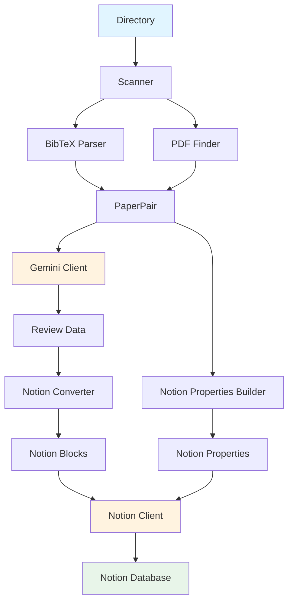
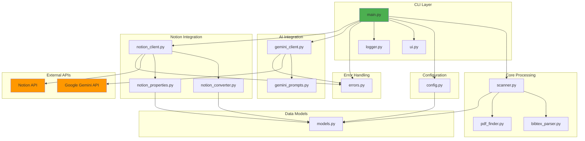
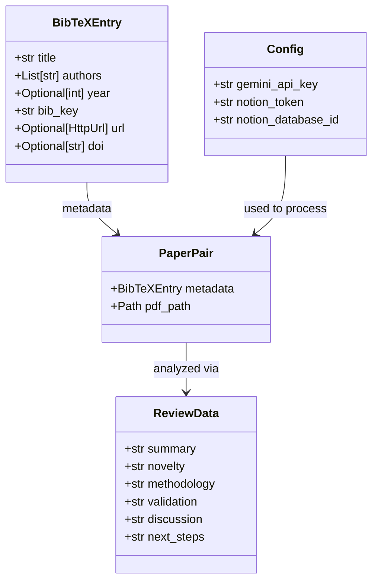

# Architecture

This document describes the system architecture, data flow, and component design of `paper-reviewer-cli`.

## Overview

`paper-reviewer-cli` is a command-line tool that automates the process of reviewing research papers. It follows a pipeline architecture where data flows through distinct stages: discovery, parsing, AI analysis, conversion, and synchronization.

The system is designed with modularity in mind, with each component handling a specific responsibility. This allows for easy testing, maintenance, and potential future extensions.

## Data Flow

The processing pipeline follows these steps:

1. **Directory Scanning**: Scan directory for BibTeX and PDF files
2. **BibTeX Parsing**: Parse BibTeX entries to extract metadata
3. **PDF Discovery**: Find corresponding PDF files
4. **Paper Pairing**: Create `PaperPair` objects combining metadata and PDF paths
5. **AI Analysis**: Upload PDF to Gemini and generate structured review
6. **Notion Conversion**: Convert review JSON to Notion block structure
7. **Property Building**: Convert BibTeX metadata to Notion properties
8. **Notion Sync**: Create Notion page with properties and blocks



## Component Architecture



## Module Descriptions

### `main.py` - CLI Entry Point and Orchestration

**Purpose**: Main entry point that orchestrates the entire pipeline.

**Key Functions**:
- `main()`: CLI entry point, handles argument parsing and high-level flow
- `process_single_paper()`: Processes a single paper through the complete pipeline

**Responsibilities**:
- Parse command-line arguments
- Load configuration
- Coordinate scanning, processing, and error handling
- Display progress and results using UI components

### `scanner.py` - Directory Scanning and File Pairing

**Purpose**: Discovers and pairs BibTeX files with PDF files.

**Key Functions**:
- `scan_directory()`: Main scanning function with single/recursive mode detection
- `scan_single_directory()`: Process a single directory
- `_find_bibtex_file()`: Locate BibTeX files
- `_create_paper_pair()`: Create PaperPair objects

**Scanning Modes**:
- **Single Directory Mode**: When root directory contains both `.bib` and `.pdf` files
- **Recursive Mode**: When scanning subdirectories for paper pairs

**Output**: List of `PaperPair` objects

### `bibtex_parser.py` - BibTeX Parsing

**Purpose**: Parse BibTeX files and extract structured metadata.

**Key Functions**:
- `parse_bibtex_file()`: Parse a BibTeX file into entries
- `extract_metadata()`: Convert raw BibTeX entry to `BibTeXEntry` model

**Features**:
- Multiple encoding support (UTF-8, Latin-1, CP1252)
- Handles various BibTeX entry types
- Robust author parsing (handles "Last, First" and "First Last" formats)
- Field normalization and validation

**Output**: List of `BibTeXEntry` objects

### `pdf_finder.py` - PDF File Discovery

**Purpose**: Locate PDF files in directories.

**Key Functions**:
- `find_pdf_in_directory()`: Find PDF file(s) in a directory (recursive search)

**Features**:
- Case-insensitive search (`.pdf`, `.PDF`, `.Pdf`)
- Recursive directory traversal
- Handles multiple PDFs (uses first found)

**Output**: `Path` object or `None`

### `gemini_client.py` - AI Analysis Integration

**Purpose**: Interface with Google Gemini API for PDF analysis.

**Key Functions**:
- `analyze_paper()`: Main function - upload PDF, wait for processing, generate review
- `upload_pdf()`: Upload PDF file to Gemini File API
- `wait_for_file_processing()`: Poll file status until ready
- `parse_gemini_response()`: Extract JSON review data from API response

**Process Flow**:
1. Initialize Gemini client
2. Upload PDF file
3. Poll file status (PROCESSING → ACTIVE)
4. Generate content with system instruction
5. Parse JSON response

**Model**: Uses `gemini-3-pro-preview` with JSON output format

**Output**: Dictionary with keys: `summary`, `novelty`, `methodology`, `validation`, `discussion`, `next_steps`

### `notion_client.py` - Notion API Integration

**Purpose**: Create pages in Notion database.

**Key Functions**:
- `create_paper_page()`: High-level function to create a complete page
- `create_page_with_blocks()`: Internal helper using Notion SDK

**Features**:
- Handles Notion API errors with custom exceptions
- Validates database ID format
- Creates pages with both properties and content blocks

**Output**: Created page ID (string)

### `notion_converter.py` - Review Data to Notion Blocks

**Purpose**: Convert structured review JSON to Notion block format.

**Key Functions**:
- `transform_to_notion_blocks()`: Main conversion function
- `create_heading_block()`: Create heading_2 blocks
- `create_paragraph_block()`: Create paragraph blocks
- `create_bullet_block()`: Create bulleted_list_item blocks
- `split_content_smartly()`: Intelligently detect and split list items

**Block Structure**:
- Section headings (heading_2)
- Content blocks (paragraph or bulleted_list_item)
- Smart detection of markdown-style lists

**Features**:
- Respects Notion's 2000-character limit per rich_text element
- Detects list patterns (markdown bullets, newline-separated items)
- Handles empty sections gracefully

**Output**: List of Notion block dictionaries

### `notion_properties.py` - Metadata to Notion Properties

**Purpose**: Convert BibTeX metadata to Notion page properties.

**Key Functions**:
- `build_notion_properties()`: Main function to build property dictionary
- `format_authors()`: Convert author list to multi_select format
- `extract_url_or_doi()`: Extract URL or DOI (prefers URL)

**Property Mapping**:
- `title` → `Name` (title property)
- `authors` → `Authors` (multi_select property)
- `year` → `Year` (number property)
- `bib_key` → `BibTeX Key` (rich_text property)
- `url` or `doi` → `URL/DOI` (url property)

**Output**: Dictionary compatible with Notion API properties format

### `models.py` - Data Models

**Purpose**: Pydantic models for type safety and validation.

**Models**:
- `BibTeXEntry`: Paper metadata (title, authors, year, bib_key, url, doi)
- `PaperPair`: Combination of BibTeXEntry and PDF path
- `ReviewData`: Structured review data from Gemini
- `Config`: Application configuration (API keys, database ID)

**Features**:
- Field validation (year range, URL format, database ID format)
- Author parsing with multiple format support
- Type coercion and normalization
- PDF path existence validation

### `config.py` - Configuration Management

**Purpose**: Load and validate configuration from environment variables.

**Key Functions**:
- `load_config()`: Load configuration from `.env` file or environment
- `Config`: Pydantic Settings class for environment variables

**Configuration Sources** (in order):
1. Explicit `.env` file path
2. `.env` in current directory
3. `.env` in project root
4. Environment variables

**Validation**: Uses Pydantic models to validate required fields and formats

### `errors.py` - Error Handling

**Purpose**: Custom exception hierarchy for better error handling.

**Exception Classes**:
- `PaperReviewerError`: Base exception class
- `BibTeXParseError`: BibTeX parsing failures
- `PDFNotFoundError`: PDF file not found
- `GeminiAPIError`: Gemini API call failures
- `NotionAPIError`: Notion API call failures

**Features**:
- All exceptions include error message and optional file path
- Preserves original exception context
- User-friendly error messages

### `ui.py` - Rich Terminal UI

**Purpose**: Beautiful terminal output using Rich library.

**Functions**:
- `display_papers_table()`: Display discovered papers in a table
- `create_progress_tracker()`: Create progress bar for batch processing
- `display_success()`: Success messages
- `display_error()`: Error messages
- `display_info()`: Info messages

**Features**:
- Color-coded output
- Progress bars with time remaining
- Formatted tables with column truncation
- Consistent styling throughout

### `logger.py` - Logging Configuration

**Purpose**: Configure Python logging for the application.

**Key Functions**:
- `setup_logging()`: Configure logging handlers
- `get_logger()`: Get logger instance for modules

**Configuration**:
- Console handler: INFO level and above
- File handler: DEBUG level and above
- Default log file: `logs/paper-reviewer.log`
- Customizable log level and file location

## External Dependencies

### Google Gemini API

**Purpose**: AI-powered PDF analysis

**Integration Points**:
- File upload API
- File status polling
- Content generation API

**Model**: `gemini-3-pro-preview`

**Limitations**:
- File processing timeout: 5 minutes (default)
- File size limits per Gemini API
- Rate limits per API key

### Notion API

**Purpose**: Create pages in Notion database

**Integration Points**:
- Page creation API
- Database access

**Requirements**:
- Internal integration token
- Database access permissions
- Correct property schema

**Limitations**:
- Rate limits per integration
- Block size limits (2000 chars per rich_text element)

### Python Packages

**Core Dependencies**:
- `google-genai`: Gemini API client
- `notion-client`: Notion API client
- `bibtexparser`: BibTeX parsing
- `pydantic`: Data validation
- `pydantic-settings`: Settings management
- `rich`: Terminal UI
- `python-dotenv`: Environment variable loading

## Error Handling Strategy

The system uses a hierarchical exception structure:

1. **Base Exception**: `PaperReviewerError` - All custom exceptions inherit from this
2. **Specific Exceptions**: Each module raises specific exceptions
3. **Error Propagation**: Exceptions bubble up to `main()` for handling
4. **User Feedback**: Errors are displayed via UI components
5. **Logging**: All errors are logged with full context

**Error Recovery**:
- BibTeX parsing errors: Skip entry, continue with others
- PDF not found: Skip paper, log warning
- API errors: Display error, continue with next paper
- Configuration errors: Exit early with helpful message

## Logging Strategy

**Log Levels**:
- `DEBUG`: Detailed diagnostic information
- `INFO`: General informational messages
- `WARNING`: Warning messages (non-critical issues)
- `ERROR`: Error messages (exceptions, failures)

**Log Destinations**:
- Console: INFO level and above (user-facing)
- File: DEBUG level and above (full diagnostic info)

**Log Format**:
```
[YYYY-MM-DD HH:MM:SS] LEVEL - module - message
```

## Data Model Relationships



## Future Extensibility

The modular architecture allows for easy extension:

1. **Additional AI Providers**: Implement new client modules following `gemini_client.py` pattern
2. **Additional Output Formats**: Add new converter modules for other platforms
3. **Custom Review Formats**: Extend `ReviewData` model and conversion logic
4. **Additional Metadata Sources**: Extend `bibtex_parser.py` or add new parsers
5. **Custom UI Themes**: Extend `ui.py` with theme support

## Performance Considerations

- **Parallel Processing**: Currently sequential, but architecture supports parallelization
- **File Upload**: Large PDFs may take time to upload and process
- **API Rate Limits**: Both Gemini and Notion APIs have rate limits
- **Memory Usage**: PDFs are loaded into memory during upload
- **Logging**: File logging may impact performance with many papers

## Security Considerations

- **API Keys**: Stored in `.env` file (should be in `.gitignore`)
- **File Access**: Validates file existence before processing
- **Input Validation**: Pydantic models validate all inputs
- **Error Messages**: Avoid exposing sensitive information in error messages
